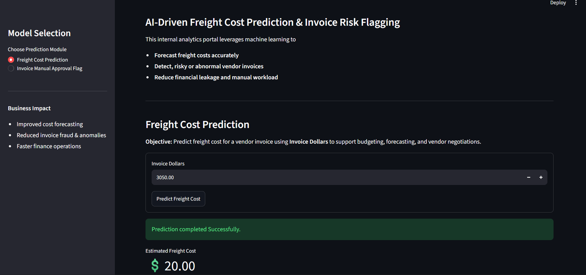
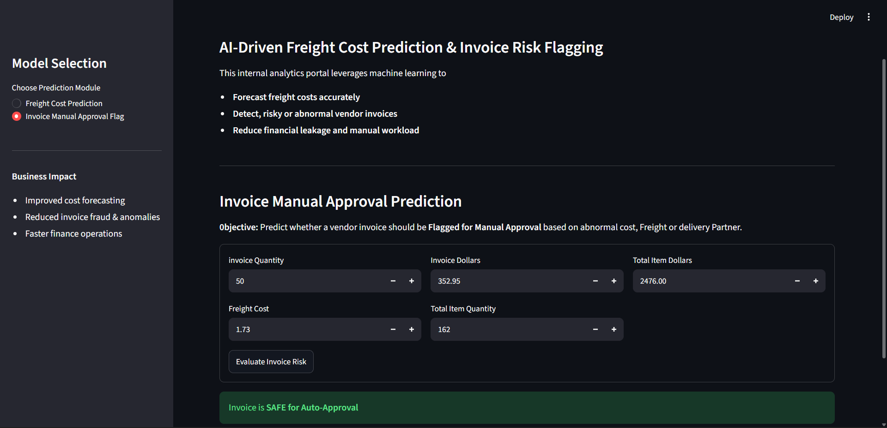

# 🧾 Vendor Invoice Intelligence System

Freight Cost Prediction and Invoice Risk Flagging
---

## 📌 Table of Contents
- [Project Overview](#project-overview)
- [Business Objectives](#business-objective)
- [Data Sources](#data-sources)
- [Exploratory Data Analysis](#exploratory-data-analysis)
- [Models Used](#models-used)
- [Evaluation Metrics](#evaluation-metrics)
- [Application](#application)
- [Project Structure](#project-structure)
- [How to Run This Project](#how-to-run-this-project)
- [Author & Contact](#author--contact)

---
## Project Overview

This project implements an end-to-end machine learning system designed to support finance teams by:

1. Predicting expected freight cost for vendor invoices.
2. Flagging high-risk invoices that require manual review due to abnormal cost, freight, or operational patterns.
---
## Business Objective

# 1. Freight Cost Prediction (Regression)

**Objective:**
Predict the expected freight cost for a vendor invoice using invoice value, and historical behavior.

**Why it matters:**
* Freight is a non-trivial component of landed cost.
* Poor freight estimation impacts margin analysis and budgeting.
* Early prediction improves procurement planning and vendor negotiation.


# 2. Invoice Risk Flagging (Classification)


**Objective:**
Predict whether a vendor invoice should be flagged for manual approval due to abnormal cost, freight, or delivery
patterns.
**Why it matters:**
* Manual invoice review does not scale.
* Financial leakage often occurs in large or complex invoices.
* Early risk detection improves audit efficiency and operational control.


---
## Data Sources

Data is stored in a relational SQLite database (inventory.db) with the following tables:

*   **vendor_invoice** - Invoice-level financial and timing data
*   **purchases** - Item-level purchase details
*   **purchase_prices** - Reference purchase prices
*   **begin_inventory**, **end_inventory** - Inventory snapshots

SQL aggregation is used to generate invoice-level features.
---

## Exploratory Data Analysis

EDA focuses on business-driven questions, such as:
* Do flagged invoices have higher financial exposure?
* Does freight scale linearly with quantity?
* Does freight cost depend on quantity?
Statistical tests (t-tests) are used to confirm that flagged invoices differ meaningfully from normal invoices.

---
## Models Used

# Regression (Freight Prediction)

* Linear Regression (baseline)
* Decision Tree Regressor
* Random Forest Regressor (final model)

# Classification (Invoice Flagging)

* Logistic Regression (baseline)
* Decision Tree Classifier
* Random Forest Classifier (final model with GridSearchCV)

Hyperparameter tuning is performed using GridSearchCV with F1-score to handle class imbalance.
---
## Evaluation Metrics

# Freight Prediction
* MAE
* RMSE
* R² Score

# Invoice Flagging
* Accuracy
* Precision, Recall, F1-score
* Classification report
* Feature importance analysis
---
## Application
A Streamlit application demonstrates the complete pipeline:
* Input invoice details
* Predict expected freight
* Flag invoices in real time
* Provide human-readable explanations

---
## Project Structure

```
inventory-invoice-analytics/
│
├── data/
│   └── inventory.db
│
├── freight_cost_prediction/
│   ├── data_preprocessing.py
│   ├── model_evaluation.py
│   └── train.py
│
├── invoice_flagging/
│   ├── data_preprocessing.py
│   ├── model_evaluation.py
│   └── train.py
│
├── inference/
│   ├── predict_freight.py
│   └── predict_invoice_flag.py
│
├── models/
│   ├── predict_freight_model.pkl
│   ├── scaler.pkl
│   └── predict_flag_invoice.pkl
│
├── notebooks/
│   ├── Invoice Flagging.pkl
│   └── Predict Freight Cost.ipynb
│
├── app.py
├── README.md
└── .gitignore
```


---
## How to Run This Project

1. Clone the repository:
```bash
git clone https://github.com/yourusername/vendor-performance-analysis.git
```
2. Train and Save best fit Models:
```bash
python freight_cost_prediction/train.py
python invoice_flagging/train.py
```
3. Test models:
```bash
python inference/predict_freight.py
python inference/predict_invoice.py
```
4. Open Application:
```bash
streamlit run app.py
```

---

## Author & Contact

**Aditya Bathre**  
Software Developer AIML  
📧 Email: bathreaditya@gmail.com  
🔗 [LinkedIn](https://www.linkedin.com/in/aditya-bathre-78b712249/)